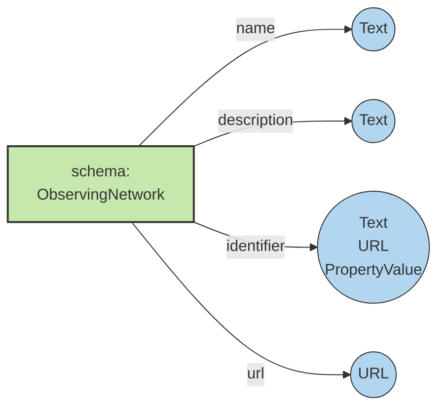

[Home](/README.md) | Observing Network

# Describing an Observing Network

An [ObservingNetwork](.) is a collection of observing-related infrastructures and activities – such as monitoring sites,
mobile platforms, research projects, field campaigns, and observing programs – that are deployed in
a diverse and distributed fashion across numerous temporal and spatial scales. Dozens of
agencies, organizations, projects, and initiatives observe or monitor earth, environmental, and human systems – 
each with its own geographic extent, thematic scope,
governance, or funding.

This guide documents a common convention to document an [ObservingNetwork](.) using schema.org vocabulary terms in a consistent way, thereby enabling the creation of information resources about observing netowrks. these information resources wil be useful for many groups, including:

- science planners to assess status, overlap, and gaps of observations
- network managers to co-locate or optimize limited resources
- community members to leverage observational efforts and data collected nearby
- data repositories, to link [Dataset](https://schema.org/Dataset) entries to the observing networks that egnerated them

To describe an ObservingNetwork in schema.org, we will model it with an existing schema.org type [schema:ResearchOrganization](https://schema.org/ResearchOrganization), with properties as shown below in [Identifying Properties](#identifying-properties). We also considered modeling an ObservingNetwork as type [schema:ResearchProject](https://schema.org/ResearchProject), which would be more transient than an organization.

<!-- TOC depthFrom:1 depthTo:6 withLinks:1 updateOnSave:1 orderedList:0 -->

- [Describing an Observing Network](#describing-an-observing-network)
    - [Identifying Properties](#identifying-properties)
    - [Identifer](#roles-of-people)
    - [Roles of People](#roles-of-people)
    - [Publisher and Provider](#publisher-and-provider)
    - [Funding](#funding)
- [SOSO-ROPON Mapping](#soso-ropon-mapping)

<!-- /TOC -->

## Identifying Properties

Core identifying properties about an observing network include common properties for all schema.org resource types, including the name, description, and identifier for the Observing Network.

- [name](https://schema.org/name) - A descriptive name of the observing network (e.g., “Snow depth in Northern Hemisphere”)
- [description](https://schema.org/description) - A short abstract describing the observing network.
- [identifier](https://schema.org/identifier) - An identifier for the observing network, such as a DOI. (text, URL, or PropertyValue).

<pre>
{
  "@context": "https://schema.org/",
  "@type": "ResearchOrganization",
  <strong>"name": "Polardex Interactive Polar Infrastructure Database",
  "description": "Polardex is a tool for polar scientists and planners. The platform lists key polar infrastructures in both the Arctic and the Antarctic, enabling logistics discovery and enhanced planning opportunities. Polardex has been developed by the EPB through the EPB's Action Group on Infrastructure, in close cooperation in close collaboration with, and data provision by, SOOS, SIOS, INTERACT, IAATO, EU-PolarNet 2, COMNAP, Isaaffik, ARICE, EUROFLEETS, AWI and BAS. The Polardex platform was developed by Blue Lobster IT Ltd.",
  "identifier": "https://polarobservingregistry.org/network/56wdygWLLgW7DOjkCpO790"</strong>
}
</pre>

The following additional basic fields make up a core description of an ObservingNetwork.

* [url](https://schema.org/url) - Location of a web page describing the observing network.
* [sameAs](https://schema.org/sameAs) - Other URLs that can be used to refer to the network.
* [keywords](https://schema.org/keywords) - Keywords summarizing the observing network.

<pre>
{
  "@context": "https://schema.org/",
  "@type": "ResearchOrganization",
  "name": "Polardex Interactive Polar Infrastructure Database",
  "description": "Polardex is a tool for polar scientists and planners. The platform lists key polar infrastructures in both the Arctic and the Antarctic, enabling logistics discovery and enhanced planning opportunities. Polardex has been developed by the EPB through the EPB's Action Group on Infrastructure, in close cooperation in close collaboration with, and data provision by, SOOS, SIOS, INTERACT, IAATO, EU-PolarNet 2, COMNAP, Isaaffik, ARICE, EUROFLEETS, AWI and BAS. The Polardex platform was developed by Blue Lobster IT Ltd.",
  "identifier": "https://polarobservingregistry.org/network/56wdygWLLgW7DOjkCpO790",
  <strong>"url": "https://polardex.org/",
  "sameAs": "https://www.soos.aq/activities/duesouth"</strong>
}
</pre>
Back to [top](#top)

## Identifier

Adding the [schema:identifier](https://schema.org/identifier) field can be done in three ways - a text description, a URL, or by using the [schema:PropertyValue](https://schema.org/PropertyValue) field.

Back to [top](#top)

### Roles of People

Back to [top](#top)

### Publisher and Provider

Back to [top](#top)

### Funding

Back to [top](#top)

# SOSO-ROPON Mapping

|SOSO_class|SOSO_property|ROPON_field|SOSO_mapping_notes|ROPON_field_definition|
|----------|-------------|-----------|------------------|----------------------|
|schema:ObservingNetwork||||Extends schema:ResearchOrganization|
||schema:name|Network Name||Full name of the observing network.|
||schema:alternateName|Network Abbreviation||Acronym or short name of the observing network.|
||schema:description|Network Description||Short summary of the observing network, including geographic or thematic scope.|
||schema:url|Network Website||Link to the website for the observing network.|
||schema:logo|Link for Network Logo||Link to an image showing the logo of the observing network.|
||schema:identifier|Network RoPON ID||A unique alphanumeric identifier automatically generated by the Registry of Polar Observing Networks (RoPON).|
||schema:parentOrganization|Organization||One or more entities responsible for funding or operation of the observing network.|
|||Domains||Scope of observations across Atmosphere, Land, and/or Ocean.|
|||Disciplines||Branch of scientific knowledge or thematic focus for the observing network.|
||schema:location|Region||Spatial coverage of the network as described by one or more broad geographical areas, such as Arctic, Antarctica, Southern Ocean, etc.|
||schema:containsPlace|Subregion|use the Place.containsPlace property to describe the "Subregion" concept with the "Region" Place being named|Spatial coverage of the network as described by smaller geographic areas, such as Alaska, Iceland, Beaufort Sea, Russian Subarctic, West Antarctica, Ross Sea, etc.|
||schema:geo|Spatial Extent|use the Place.geo property on the "Region" field |Spatial coverage of the network as delineated by one or more polygons, each as a series of four or more points in latitude and longitude (decimal degrees), where the first and final points are identical (e.g., "polygon": "67.6199 -42.3773 67.6199 17.1685 57.7191 17.1685 57.7191 -42.3773 67.6199 -42.3773").  Separate polygons with the pipe ("|") symbol.|
||schema:foundingDate|Year Started||The year that observations within the network began.|
||schema:contactPoint|Contact||Email address or URL for contacting the observing network.|
|||Data Repository||One or more links to data repositories hosting scientific data from the network (such as the Polar Data Catalogue, NSF Arctic Data Center, or PANGAEA).  (This field pertains to scientific datasets, not observing assets).|
|||Asset Types||Categorization of discrete infrastructure or coordinated activities for observing such as sites, mobile platforms, projects, campaigns, and initiatives.|
|||Asset-Level Metadata Catalog?||Does the network have a catalog, spreadsheet, list, or other means of tracking details about individual observing assets such as observing sites, mobile platforms, research projects, field campaigns, cruises, programs, etc.?  (This field pertains to observing assets, not scientific datasets). |
|||Metadata Access?||Is the network's asset-level catalog, spreadsheet, list, or other documentation enabled online for public viewing, download, or other access?|
|||Machine-Readable Access?||Is the network's asset-level metadata catalog enabled for access with an API or endpoint URL for automated harvesting of asset-level metadata records?|
|||Metadata Standards||Metadata standards, or a custom schema, in use for public access to a network's structured information about observing assets (such as ISO 19115, INSPIRE EF, WMO WIGOS, etc.).|
|||Access Protocols||Transfer protocols or web service formats in use for public access to a network's structured information about observing assets (such as file download, custom API, OGC WMS, or OAI-PMH).|
|||Links for Metadata Catalog||Link to one or more webpages presenting a network's catalog, spreadsheet, list, or other documentation about observing assets.|
||schema:dateModified|Date Last Modified|misplaced property, not a property of schema:Organization, only applies to schema:CreativeWork|An automatically generated timestamp for the last time that content within a record was changed or updated.|
||schema:editor|Last Modified By|misplaced property, not a property of schema:Organization, only applies to schema:CreativeWork|First name and last name of the person that last changed or edited content in a record.|

Back to [top](#top)
