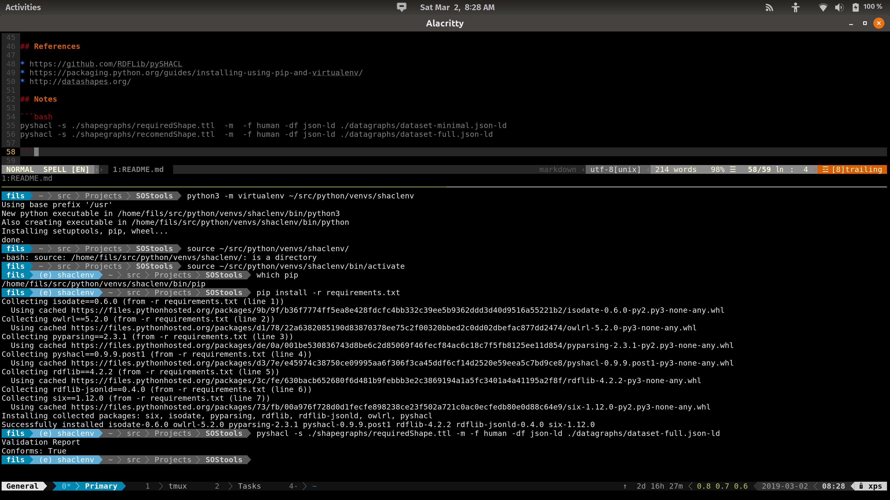

# SOS (science on schema) PySHACL 

## Test Driven Graph Development

SOStools is the start of working to explore a test driven model development
approach to working with schema.org and extensions.

The goal is to use SHACL to define our goals as constraint and then
test our graphs against this constraint.  

## Set up a Python Env with pySHACL (see refs)

A requirements.txt provides all the needed pip installs.  The following
should work to set up a new environment for you.  You can also simply install 
these into your main python3 installation if you wish.

```bash
# before 15.1.0
virtualenv --no-site-packages --distribute .env &&\
source .env/bin/activate &&\
pip install -r requirements.txt

# after deprecation of some arguments in 15.1.0
virtualenv .env && source .env/bin/activate && pip install -r requirements.txt
```

Then to activate / deactivate use the following

* source shaclvenv/bin/activate
* deactivate

A full process of setting up this approach is below.  Here I have used 
a directory in my ~/src/python/venvs to house all my various virtual environments. 

```bash
> python3 -m virtualenv ~/src/python/venvs/shaclenv
Using base prefix '/usr'
New python executable in /home/fils/src/python/venvs/shaclenv/bin/python3
Also creating executable in /home/fils/src/python/venvs/shaclenv/bin/python
Installing setuptools, pip, wheel...
done.
> source ~/src/python/venvs/shaclenv/bin/activate
> which pip
/home/fils/src/python/venvs/shaclenv/bin/pip
> pip install -r requirements.txt
[ ...  pip install output removed ... ]
Installing collected packages: six, isodate, pyparsing, rdflib, rdflib-jsonld, owlrl, pyshacl
Successfully installed isodate-0.6.0 owlrl-5.2.0 pyparsing-2.3.1 pyshacl-0.9.9.post1 rdflib-4.2.2 rdflib-jsonld-0.4.0 six-1.12.0

now test this

> pyshacl -s ./shapegraphs/requiredShape.ttl -m -f human -df json-ld ./datagraphs/dataset-full.json-ld
Validation Report
Conforms: True
```




## References

* https://www.w3.org/TR/shacl/
* https://github.com/RDFLib/pySHACL
* https://packaging.python.org/guides/installing-using-pip-and-virtualenv/
* http://datashapes.org/

## Notes

Example commands:
```bash
pyshacl -s ./shapegraphs/requiredShape.ttl  -m  -f human -df json-ld ./datagraphs/dataset-minimal.json-ld
pyshacl -s ./shapegraphs/recomendShape.ttl  -m  -f human -df json-ld ./datagraphs/dataset-full.json-ld

```

Example output
```
pyshacl -s ./shapegraphs/recomendShape.ttl  -m  -f human -df json-ld ./datagraphs/dataset-full.json-ld
Validation Report
Conforms: True

pyshacl -s ./shapegraphs/recomendShape.ttl  -m  -f human -df json-ld ./datagraphs/dataset-minimal.json-ld
Validation Report
Conforms: False
Results (1):
Constraint Violation in MinCountConstraintComponent (http://www.w3.org/ns/shacl#MinCountConstraintComponent):
Severity: sh:Violation
Source Shape: [ sh:maxCount Literal("1", datatype=xsd:integer) ; sh:minCount Literal("1", datatype=xsd:integer) ; sh:path <http://schema.org/citation>  ]
Focus Node: [  ]
Result Path: <http://schema.org/citation>
```

