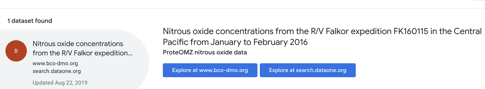

# 5. Identifier

#### Lesson
> - Creating Object properties with their own `@type`
> - Weighing expressivity vs. simplicity
> - Re-using what we learned about arrays

**Guidelines:** 
[Identifier](/guides/Dataset.md#identifier)

**Source:**
[Line 5](/tutorials/esip-summer-mtg-2022/examples/dataset-01.txt#L5)

```
doi: "10.26008/1912/bco-dmo.775849.1"
```

### Schema.org Identifier

- https://schema.org/identifier
    - <strong>`Text`
    - `URL`</strong>
    - `PropertyValue`


#### Identifiers as Text - Good


<pre>
{
  "@context": "https://schema.org/",
  <strong>"identifier": "doi:10.26008/1912/bco-dmo.775849.1"</strong>
}
</pre>

> **NOTE:** specifying "doi:" before the DOI value lets harvesters know that `10.26008/1912/bco-dmo.775849.1` is a DOI and not some other identifier type


#### Identifiers as URL - Better

<pre>
{
  "@context": "https://schema.org/",
  <strong>"identifier": "https://doi.org/10.26008/1912/bco-dmo.775849.1"</strong>
}
</pre>

### SameAs

- https://schema.org/sameAs
    - `URL`

> Inform the harvesters/search engines of other web pages that describe the same exact thing
> - So your page can be added as possible search results when the other page is found
> - Provides better information and context to web searchers



<pre>
{
  "@context": "https://schema.org/",
  "identifier": "https://doi.org/10.26008/1912/bco-dmo.775849.1",
  <strong>"sameAs": "https://doi.org/10.26008/1912/bco-dmo.775849.1"</strong>
}
</pre>

### Updated Markup - Identifier

<pre>
{
  "@context": "https://schema.org/",
  "@type": "Dataset",
  "name": "Nitrous oxide concentrations from the R/V Falkor expedition FK160115 in the Central Pacific from January to February 2016",
  "description": "Dissolved N2O concentrations from were measured in discrete samples on a research expedition to the Equatorial Pacific. Water samples were collected using a 24 bottle Niskin rosette equipped with a CTD. N₂O concentrations were measured using a headspace equilibration method and analyzed on a SRI Greenhouse Gas Monitoring Gas Chromatograph.",
  "url": "https://www.bco-dmo.org/dataset/775849",
  "version": "1",
  "isAccessibleForFree": "true",
  "dateCreated": "2019-08-22",
  "dateModified": "2019-08-22",
  "datePublished": "2022-06-08",
  "keywords": [
    "nitrous oxide", 
    "Central Pacific", 
    "headspace equilibration", 
    "SRI Greenhouse Gas Monitoring Gas Chromatograph",
    "CTD profiler",
    "Gas Chromatograph"
  ],
  "license": ["https://spdx.org/licenses/CC-BY-4.0", "https://creativecommons.org/licenses/by/4.0/"],
  <strong>"identifier": "https://doi.org/10.26008/1912/bco-dmo.775849.1",
  "sameAs": "https://doi.org/10.26008/1912/bco-dmo.775849.1"</strong>
}
</pre>
<hr/>

[Section #6: Publisher >>](06_publisher.md)

<hr/>

### Resources
- **Source:** [ProteOMZ nitrous oxide data](/tutorials/esip-summer-mtg-2022/examples/dataset-01.txt) (example metadata)
- **Testing:** [Google Rich Results Tool](https://search.google.com/test/rich-results)
